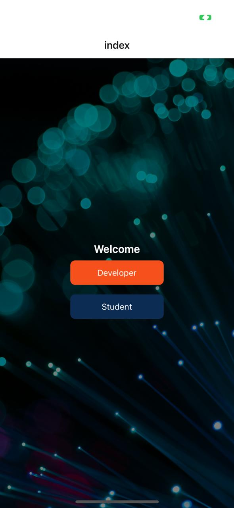
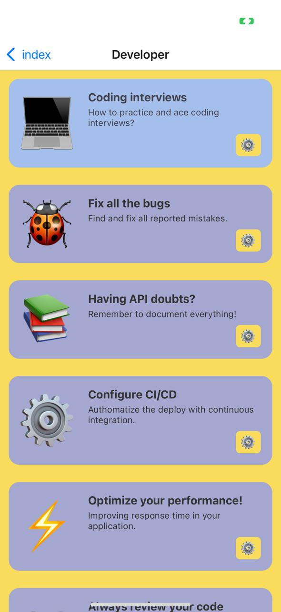
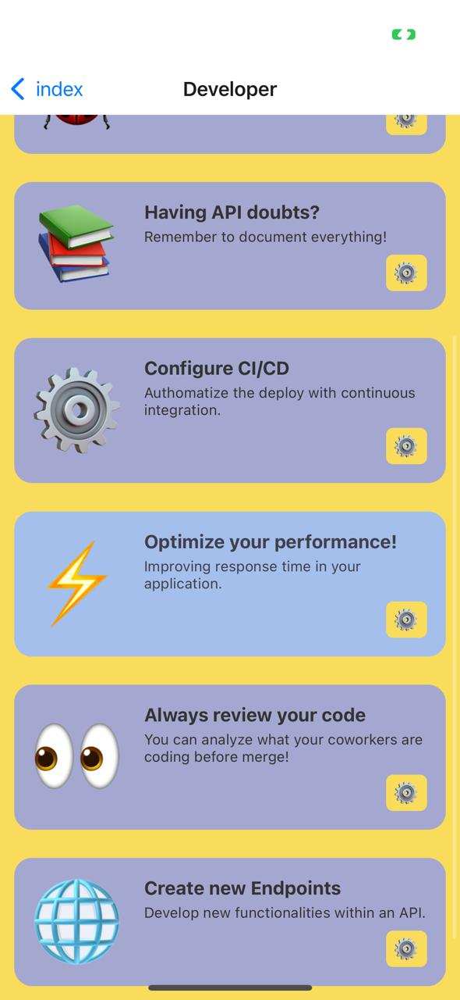
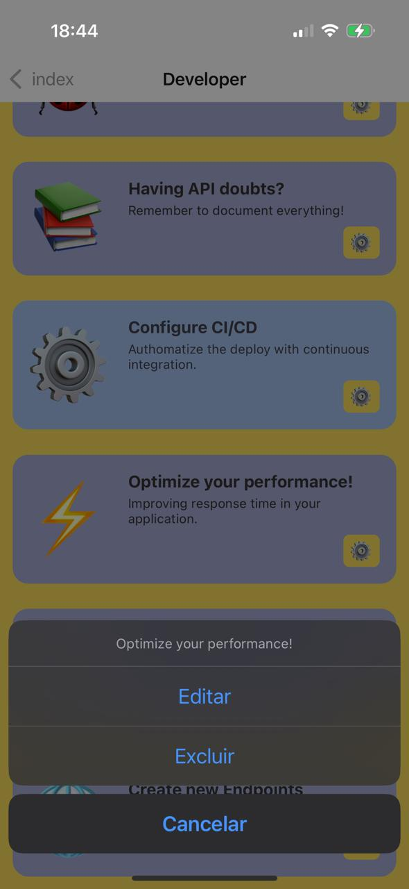
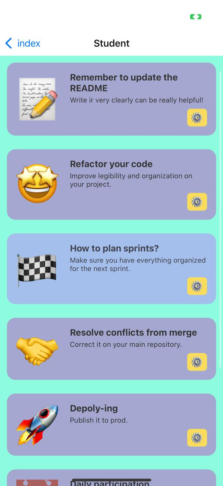
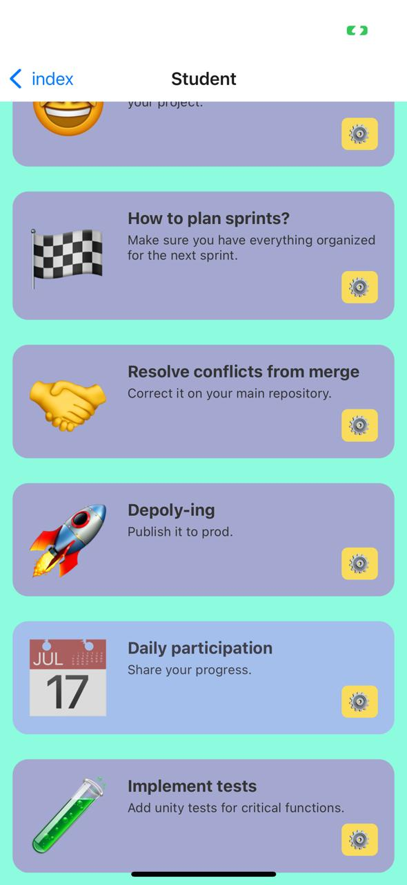
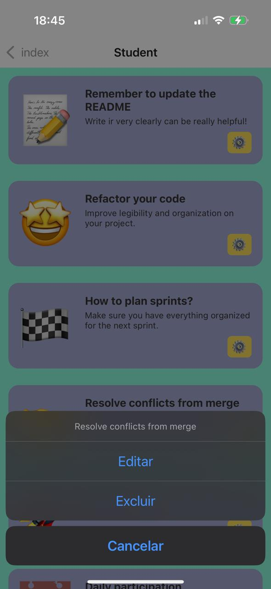

# Dev-ify

> A ideia inicial era criar um app/uma rede social para compartilhamento de informações de devs profissionais e estudantes, para facilitar networking.
> O obtido (até o momento) é meramente uma ilustração do que pode vir a se tornar.
> Realmente acredito que é uma ideia interessante que pode ser melhor desenvolvida futuramente.

---

## Aplicativo

Index Screen



Developer Screen





Student Screen





---

## Como rodar o projeto

### Pré-requisitos

- [Node.js](https://nodejs.org/) (versão 18 ou superior)
- [Expo CLI](https://docs.expo.dev/get-started/installation/)
- Um gerenciador de pacotes, como [npm](https://www.npmjs.com/) ou [yarn](https://yarnpkg.com/)

---

### Passo a passo

1. **Clone o repositório**

   ```bash
   git clone https://github.com/dzlucs/pdm-avaliacao-1.git
   cd pdm-avaliacao-1
   ```

2. **Instale as dependências**

   ```bash
   npm install
   ```

   ou, se preferir:

   ```bash
   yarn
   ```

3. **Inicie o servidor de desenvolvimento Expo**

   ```bash
   npx expo start
   ```

4. **Execute o app:**
   - Abra o app [Expo Go](https://expo.dev/client) no seu celular Android/iOS.
   - Escaneie o QR Code que aparecerá no terminal ou navegador.
   - Ou, se estiver em um emulador/simulador, escolha a opção correspondente no menu do Expo.

---

### Observações

- Para rodar em um emulador Android, é necessário ter o Android Studio instalado e configurado.
- Alterações no código são refletidas automaticamente no app em tempo real.
- Para instalar o Expo CLI globalmente (opcional):
  ```bash
  npm install -g expo-cli
  ```

# AVALIAÇÃO 2

## Testes Automatizados em Aplicações Mobile

### Diferença entre Testes Unitários e Testes E2E

**Testes unitários** são responsáveis por validar partes isoladas do código, como funções, hooks ou componentes individuais, sem dependências externas. Eles garantem que cada unidade do sistema funcione de forma correta e independente. Em aplicações mobile com React Native/Expo, por exemplo, podemos testar um componente visualmente ou um hook customizado de lógica.

**Testes E2E (End-to-End)** simulam o uso real do aplicativo, validando fluxos completos de usuário e a integração entre diferentes partes do sistema. Eles são executados em dispositivos reais ou emuladores e interagem com a interface do app, validando desde os inputs do usuário até a resposta visual. O objetivo é garantir que todos os componentes funcionem corretamente juntos.

> Referências:
>
> - https://docs.expo.dev/develop/unit-testing/
> - https://maestro.mobile.dev/

## Como rodar os testes

### Testes Unitários

1. Instale as dependências:

   ```bash
   npm install --save-dev @testing-library/react-native jest
   ```

   ```bash
   npm install
   ```

2. Execute os testes unitários:
   ```bash
   npm test
   ```

Testes unitários podem ser rodados em qualquer ambiente, pois rodam no Node.js com Jest.

### Testes E2E (End-to-End)

1. Instale o Maestro:
   [Instruções oficiais](https://maestro.mobile.dev/getting-started/installation/)

Realizar 2x o comando abaixo:

```
curl -fsSL "https://get.maestro.mobile.dev" | bash
```

2. Execute um fluxo de teste (exemplo):
   ```bash
   maestro test maestro/flows/login_flow.yaml
   ```

INSTALE CYPRESS

```
npm install cypress --save-dev
```

ou

```
yarn add cypress --dev
```

Abra o Cypress

```
npx cypress open
```

Na interface gráfica do Cypress é possível criar e rodar os testes
Criar estrutura de arquivos
cypress/e2e/

crie o teste

para rodar com interface gráfica:

```
npx cypress open
```

para rodar sem interface (modo headless)

```
npx cypress run
```

---
